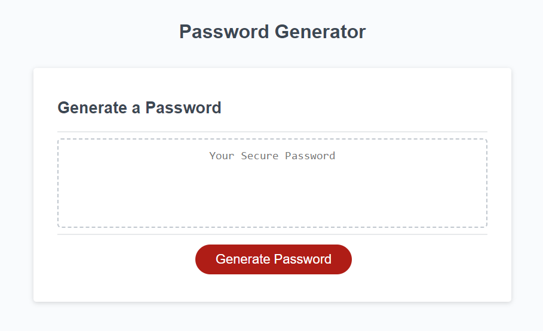
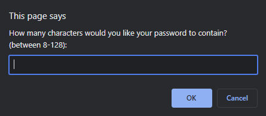
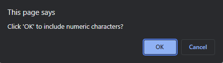
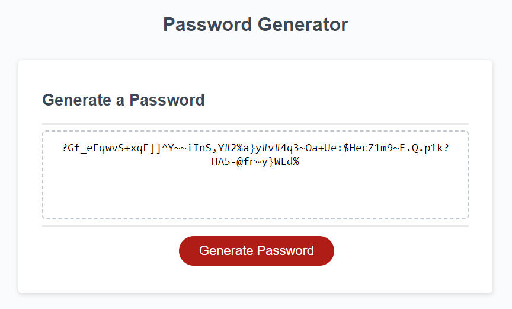

# Secure-Password-Generator-Week-3-Challenge

## Link : https://deverstater07.github.io/Secure-Password-Generator-Week-3-Challenge/ 

## Description

This project was to create a secure password generator that allows the user to approve of what criteria is used in generating the password. This project has allowed me to get a better understanding of how to use functions and their purpose in javascript. This project has also allowed me to get more used to the javascript language and defining variables, arrays, using for loops and creating prompts and creating apps that interact with users.

## Installation

N/A

## Usage

To start click on "Generate Password" button to begin password generation.

A prompt will pop-up asking you to input the number of characters you would like the password to have. 

Once you input a number between 8 and 128, a series of prompts will pop-up asking you to click on ok to confirm including a character type. Click on ok for the character typse you would like to include and click on cancel to not include those character types. 

Once at least one character type has been included, a password will be generated and show up in the Your Secure Password text box.

## Credits

N/A

## License

N/A